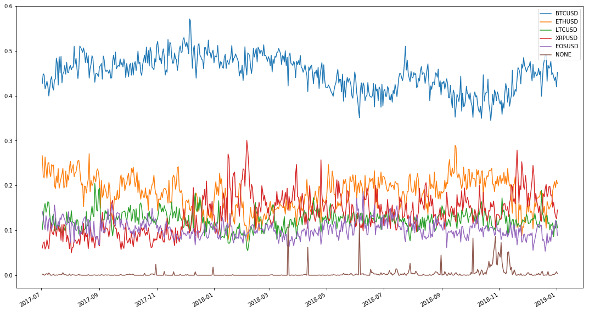

## Crypto-analysis

Provide aggregated information for these events:
- A currency wins for each interval. Winning = highest change in pct.
- There is no trade for x currencies in during an interval

## How to run
Firstly, restore packages with Pipenv

The program has 2 phases
- Aggregating the data
- Run analysis on the data

To aggregate the data
- You need a postgres instance
- Fetch data using this https://github.com/fuksi/bfxdata
    * branch: tradings
    * flags: --includetradings
    * make sure you have correct connection string in ```db.py```
- Aggregate using ```main.py``` in this project

The analysis is done with jupyter notebook
- notebook file ```Crytocurrencies analysis.ipynb```
- just re-execute all cells

### Analysis

#### Objective
Show statistical analysis on
- Random variable 'winning', where X='BTC' is the event where BTC price increase the most in pct compared to other ccys during in interval
- Random varible 'no trade', where X='BTC' is the event where BTC was not traded during an interval

#### Approach
Just explore data by counting for now 


#### Dependencies


```python
# Tech
import os
import sys
import pandas as pd
import numpy as np
import pendulum
import matplotlib
import matplotlib.pyplot as plt
import datetime

from src.models import DeltaPoint, Trade    
from src.computed import get_pricepoints_winner_count, get_all_result

intervals = ['15', '20', '30', '60', '120', '300']
```

#### Some info about data points


```python
# Get data
all_result = get_all_result()
timestamps = [pendulum.from_timestamp(ts) for ts in all_result[0]]
data_points = all_result[1]
for data_point in data_points:
    for interval in intervals:
        mm = data_point[interval]['movements']
        data_point[interval]['movements'] = np.array(mm) / sum(mm)
```


```python
def show_eval_period(timestamps):
    print(f'Evaluation period: from {timestamps[0].to_formatted_date_string()} to {timestamps[-1].to_formatted_date_string()}')
    print(f'Number of days: {timestamps[-1].diff(timestamps[0]).in_days()}')
          
show_eval_period(timestamps)
```

    Evaluation period: from Jul 02, 2017 to Jan 02, 2019
    Number of days: 549
    


```python
# Settings
periods = [7, 30, 183, 365]
periods.append(len(timestamps))
periods_text = ['Week', 'Month', 'Half-year', 'Year', 'All']
winners = ['BTCUSD', 'ETHUSD', 'LTCUSD', 'XRPUSD', 'EOSUSD', 'NONE']
```

## Winning distribution


```python
def compare_winning_periods(interval):
    winners_dict = {}
    for w in winners:
        winners_dict[w] = []
        for p in periods:
            count = 0
            for i in range(p):
                count += data_points[i][str(interval)]['winners'][w]
                
            avg = count / p
                
            winners_dict[w].append(avg)
                
    df = pd.DataFrame(winners_dict, index=periods_text).round(2)
    
    return df
```

#### 15s interval


```python
df = compare_winning_periods(15)
df.head()
```


<div>
<style scoped>
    .dataframe tbody tr th:only-of-type {
        vertical-align: middle;
    }

    .dataframe tbody tr th {
        vertical-align: top;
    }

    .dataframe thead th {
        text-align: right;
    }
</style>
<table border="1" class="dataframe">
  <thead>
    <tr style="text-align: right;">
      <th></th>
      <th>BTCUSD</th>
      <th>ETHUSD</th>
      <th>LTCUSD</th>
      <th>XRPUSD</th>
      <th>EOSUSD</th>
      <th>NONE</th>
    </tr>
  </thead>
  <tbody>
    <tr>
      <th>Week</th>
      <td>0.40</td>
      <td>0.26</td>
      <td>0.12</td>
      <td>0.03</td>
      <td>0.13</td>
      <td>0.06</td>
    </tr>
    <tr>
      <th>Month</th>
      <td>0.41</td>
      <td>0.27</td>
      <td>0.10</td>
      <td>0.04</td>
      <td>0.13</td>
      <td>0.05</td>
    </tr>
    <tr>
      <th>Half-year</th>
      <td>0.44</td>
      <td>0.24</td>
      <td>0.12</td>
      <td>0.06</td>
      <td>0.11</td>
      <td>0.02</td>
    </tr>
    <tr>
      <th>Year</th>
      <td>0.43</td>
      <td>0.22</td>
      <td>0.12</td>
      <td>0.08</td>
      <td>0.12</td>
      <td>0.02</td>
    </tr>
    <tr>
      <th>All</th>
      <td>0.42</td>
      <td>0.22</td>
      <td>0.11</td>
      <td>0.09</td>
      <td>0.12</td>
      <td>0.05</td>
    </tr>
  </tbody>
</table>
</div>


#### 20s interval


```python
df = compare_winning_periods(20)
df.head()
```


<div>
<style scoped>
    .dataframe tbody tr th:only-of-type {
        vertical-align: middle;
    }

    .dataframe tbody tr th {
        vertical-align: top;
    }

    .dataframe thead th {
        text-align: right;
    }
</style>
<table border="1" class="dataframe">
  <thead>
    <tr style="text-align: right;">
      <th></th>
      <th>BTCUSD</th>
      <th>ETHUSD</th>
      <th>LTCUSD</th>
      <th>XRPUSD</th>
      <th>EOSUSD</th>
      <th>NONE</th>
    </tr>
  </thead>
  <tbody>
    <tr>
      <th>Week</th>
      <td>0.41</td>
      <td>0.26</td>
      <td>0.13</td>
      <td>0.04</td>
      <td>0.13</td>
      <td>0.03</td>
    </tr>
    <tr>
      <th>Month</th>
      <td>0.42</td>
      <td>0.26</td>
      <td>0.11</td>
      <td>0.05</td>
      <td>0.13</td>
      <td>0.03</td>
    </tr>
    <tr>
      <th>Half-year</th>
      <td>0.45</td>
      <td>0.24</td>
      <td>0.13</td>
      <td>0.07</td>
      <td>0.11</td>
      <td>0.01</td>
    </tr>
    <tr>
      <th>Year</th>
      <td>0.44</td>
      <td>0.22</td>
      <td>0.12</td>
      <td>0.09</td>
      <td>0.12</td>
      <td>0.01</td>
    </tr>
    <tr>
      <th>All</th>
      <td>0.43</td>
      <td>0.22</td>
      <td>0.11</td>
      <td>0.10</td>
      <td>0.12</td>
      <td>0.03</td>
    </tr>
  </tbody>
</table>
</div>


#### 30s interval


```python
df = compare_winning_periods(30)
df.head()
```


<div>
<style scoped>
    .dataframe tbody tr th:only-of-type {
        vertical-align: middle;
    }

    .dataframe tbody tr th {
        vertical-align: top;
    }

    .dataframe thead th {
        text-align: right;
    }
</style>
<table border="1" class="dataframe">
  <thead>
    <tr style="text-align: right;">
      <th></th>
      <th>BTCUSD</th>
      <th>ETHUSD</th>
      <th>LTCUSD</th>
      <th>XRPUSD</th>
      <th>EOSUSD</th>
      <th>NONE</th>
    </tr>
  </thead>
  <tbody>
    <tr>
      <th>Week</th>
      <td>0.42</td>
      <td>0.25</td>
      <td>0.13</td>
      <td>0.05</td>
      <td>0.13</td>
      <td>0.01</td>
    </tr>
    <tr>
      <th>Month</th>
      <td>0.43</td>
      <td>0.25</td>
      <td>0.11</td>
      <td>0.06</td>
      <td>0.13</td>
      <td>0.01</td>
    </tr>
    <tr>
      <th>Half-year</th>
      <td>0.46</td>
      <td>0.22</td>
      <td>0.13</td>
      <td>0.08</td>
      <td>0.11</td>
      <td>0.00</td>
    </tr>
    <tr>
      <th>Year</th>
      <td>0.45</td>
      <td>0.20</td>
      <td>0.13</td>
      <td>0.10</td>
      <td>0.11</td>
      <td>0.01</td>
    </tr>
    <tr>
      <th>All</th>
      <td>0.44</td>
      <td>0.21</td>
      <td>0.12</td>
      <td>0.11</td>
      <td>0.11</td>
      <td>0.01</td>
    </tr>
  </tbody>
</table>
</div>


#### 60s interval


```python
df = compare_winning_periods(60)
df.head()
```


<div>
<style scoped>
    .dataframe tbody tr th:only-of-type {
        vertical-align: middle;
    }

    .dataframe tbody tr th {
        vertical-align: top;
    }

    .dataframe thead th {
        text-align: right;
    }
</style>
<table border="1" class="dataframe">
  <thead>
    <tr style="text-align: right;">
      <th></th>
      <th>BTCUSD</th>
      <th>ETHUSD</th>
      <th>LTCUSD</th>
      <th>XRPUSD</th>
      <th>EOSUSD</th>
      <th>NONE</th>
    </tr>
  </thead>
  <tbody>
    <tr>
      <th>Week</th>
      <td>0.43</td>
      <td>0.24</td>
      <td>0.14</td>
      <td>0.07</td>
      <td>0.12</td>
      <td>0.0</td>
    </tr>
    <tr>
      <th>Month</th>
      <td>0.44</td>
      <td>0.22</td>
      <td>0.12</td>
      <td>0.09</td>
      <td>0.12</td>
      <td>0.0</td>
    </tr>
    <tr>
      <th>Half-year</th>
      <td>0.47</td>
      <td>0.19</td>
      <td>0.13</td>
      <td>0.10</td>
      <td>0.11</td>
      <td>0.0</td>
    </tr>
    <tr>
      <th>Year</th>
      <td>0.46</td>
      <td>0.18</td>
      <td>0.12</td>
      <td>0.13</td>
      <td>0.10</td>
      <td>0.0</td>
    </tr>
    <tr>
      <th>All</th>
      <td>0.45</td>
      <td>0.18</td>
      <td>0.12</td>
      <td>0.14</td>
      <td>0.10</td>
      <td>0.0</td>
    </tr>
  </tbody>
</table>
</div>


#### 2 mins interval


```python
df = compare_winning_periods(120)
df.head()
```


<div>
<style scoped>
    .dataframe tbody tr th:only-of-type {
        vertical-align: middle;
    }

    .dataframe tbody tr th {
        vertical-align: top;
    }

    .dataframe thead th {
        text-align: right;
    }
</style>
<table border="1" class="dataframe">
  <thead>
    <tr style="text-align: right;">
      <th></th>
      <th>BTCUSD</th>
      <th>ETHUSD</th>
      <th>LTCUSD</th>
      <th>XRPUSD</th>
      <th>EOSUSD</th>
      <th>NONE</th>
    </tr>
  </thead>
  <tbody>
    <tr>
      <th>Week</th>
      <td>0.45</td>
      <td>0.21</td>
      <td>0.14</td>
      <td>0.09</td>
      <td>0.11</td>
      <td>0.0</td>
    </tr>
    <tr>
      <th>Month</th>
      <td>0.46</td>
      <td>0.19</td>
      <td>0.12</td>
      <td>0.12</td>
      <td>0.11</td>
      <td>0.0</td>
    </tr>
    <tr>
      <th>Half-year</th>
      <td>0.49</td>
      <td>0.17</td>
      <td>0.12</td>
      <td>0.12</td>
      <td>0.10</td>
      <td>0.0</td>
    </tr>
    <tr>
      <th>Year</th>
      <td>0.47</td>
      <td>0.16</td>
      <td>0.11</td>
      <td>0.16</td>
      <td>0.09</td>
      <td>0.0</td>
    </tr>
    <tr>
      <th>All</th>
      <td>0.46</td>
      <td>0.16</td>
      <td>0.12</td>
      <td>0.17</td>
      <td>0.09</td>
      <td>0.0</td>
    </tr>
  </tbody>
</table>
</div>


#### 5 mins interval


```python
df = compare_winning_periods(300)
df.head()
```


<div>
<style scoped>
    .dataframe tbody tr th:only-of-type {
        vertical-align: middle;
    }

    .dataframe tbody tr th {
        vertical-align: top;
    }

    .dataframe thead th {
        text-align: right;
    }
</style>
<table border="1" class="dataframe">
  <thead>
    <tr style="text-align: right;">
      <th></th>
      <th>BTCUSD</th>
      <th>ETHUSD</th>
      <th>LTCUSD</th>
      <th>XRPUSD</th>
      <th>EOSUSD</th>
      <th>NONE</th>
    </tr>
  </thead>
  <tbody>
    <tr>
      <th>Week</th>
      <td>0.47</td>
      <td>0.19</td>
      <td>0.13</td>
      <td>0.10</td>
      <td>0.11</td>
      <td>0.0</td>
    </tr>
    <tr>
      <th>Month</th>
      <td>0.47</td>
      <td>0.16</td>
      <td>0.11</td>
      <td>0.16</td>
      <td>0.10</td>
      <td>0.0</td>
    </tr>
    <tr>
      <th>Half-year</th>
      <td>0.50</td>
      <td>0.14</td>
      <td>0.11</td>
      <td>0.15</td>
      <td>0.10</td>
      <td>0.0</td>
    </tr>
    <tr>
      <th>Year</th>
      <td>0.49</td>
      <td>0.13</td>
      <td>0.10</td>
      <td>0.20</td>
      <td>0.08</td>
      <td>0.0</td>
    </tr>
    <tr>
      <th>All</th>
      <td>0.48</td>
      <td>0.13</td>
      <td>0.10</td>
      <td>0.21</td>
      <td>0.08</td>
      <td>0.0</td>
    </tr>
  </tbody>
</table>
</div>


#### 60s interval


```python
df = compare_winning_periods(60)
df.head()
```


<div>
<style scoped>
    .dataframe tbody tr th:only-of-type {
        vertical-align: middle;
    }

    .dataframe tbody tr th {
        vertical-align: top;
    }

    .dataframe thead th {
        text-align: right;
    }
</style>
<table border="1" class="dataframe">
  <thead>
    <tr style="text-align: right;">
      <th></th>
      <th>BTCUSD</th>
      <th>ETHUSD</th>
      <th>LTCUSD</th>
      <th>XRPUSD</th>
      <th>EOSUSD</th>
      <th>NONE</th>
    </tr>
  </thead>
  <tbody>
    <tr>
      <th>Week</th>
      <td>0.43</td>
      <td>0.24</td>
      <td>0.14</td>
      <td>0.07</td>
      <td>0.12</td>
      <td>0.0</td>
    </tr>
    <tr>
      <th>Month</th>
      <td>0.44</td>
      <td>0.22</td>
      <td>0.12</td>
      <td>0.09</td>
      <td>0.12</td>
      <td>0.0</td>
    </tr>
    <tr>
      <th>Half-year</th>
      <td>0.47</td>
      <td>0.19</td>
      <td>0.13</td>
      <td>0.10</td>
      <td>0.11</td>
      <td>0.0</td>
    </tr>
    <tr>
      <th>Year</th>
      <td>0.46</td>
      <td>0.18</td>
      <td>0.12</td>
      <td>0.13</td>
      <td>0.10</td>
      <td>0.0</td>
    </tr>
    <tr>
      <th>All</th>
      <td>0.45</td>
      <td>0.18</td>
      <td>0.12</td>
      <td>0.14</td>
      <td>0.10</td>
      <td>0.0</td>
    </tr>
  </tbody>
</table>
</div>


## Winning ratio plot 
(60s interval)


```python
def plot_winning_ratio(period):
    x = [datetime.datetime.utcfromtimestamp(ts) for ts in all_result[0]]

    
    for winner in winners:
        values = [data_point['60']['winners'][winner] for data_point in data_points]
        fig = plt.gcf()
        plt.plot(x, values)
        
    fig.set_size_inches(18.5, 10.5)
    fig.autofmt_xdate()
    plt.legend(winners, loc='upper right')
    plt.show()
```


```python
plot_winning_ratio(60)
```





### Winning ratio spectrum  
(60s interval)


```python
# cols: mean min max
# rows: currency
indices = winners
rows = []
cols = ['Mean', 'Min', 'Max']
for winner in winners:
    values = np.array([data_point['60']['winners'][winner] for data_point in data_points])
    row = []
    row.append(values.mean())
    row.append(values.min())
    row.append(values.max())
    rows.append(row)
    
spect_df = pd.DataFrame(rows, columns=cols, index=indices).round(2)
spect_df.head()

```


<div>
<style scoped>
    .dataframe tbody tr th:only-of-type {
        vertical-align: middle;
    }

    .dataframe tbody tr th {
        vertical-align: top;
    }

    .dataframe thead th {
        text-align: right;
    }
</style>
<table border="1" class="dataframe">
  <thead>
    <tr style="text-align: right;">
      <th></th>
      <th>Mean</th>
      <th>Min</th>
      <th>Max</th>
    </tr>
  </thead>
  <tbody>
    <tr>
      <th>BTCUSD</th>
      <td>0.45</td>
      <td>0.34</td>
      <td>0.57</td>
    </tr>
    <tr>
      <th>ETHUSD</th>
      <td>0.18</td>
      <td>0.08</td>
      <td>0.29</td>
    </tr>
    <tr>
      <th>LTCUSD</th>
      <td>0.12</td>
      <td>0.05</td>
      <td>0.20</td>
    </tr>
    <tr>
      <th>XRPUSD</th>
      <td>0.14</td>
      <td>0.05</td>
      <td>0.30</td>
    </tr>
    <tr>
      <th>EOSUSD</th>
      <td>0.10</td>
      <td>0.05</td>
      <td>0.19</td>
    </tr>
  </tbody>
</table>
</div>


### Trade count ratio


```python
def compare_notrades_periods(interval):
    tradecount_dict = {}
    for trade_count in range(6):
        tradecount_dict[trade_count] = []
        for p in periods:
            count = 0
            for i in range(p):
                count += data_points[i][str(interval)]['movements'][trade_count]
                
            avg = count / p
                
            tradecount_dict[trade_count].append(avg)
                
    df = pd.DataFrame(tradecount_dict, index=periods_text).round(2)
    
    return df

compare_notrades_periods(30)
```


<div>
<style scoped>
    .dataframe tbody tr th:only-of-type {
        vertical-align: middle;
    }

    .dataframe tbody tr th {
        vertical-align: top;
    }

    .dataframe thead th {
        text-align: right;
    }
</style>
<table border="1" class="dataframe">
  <thead>
    <tr style="text-align: right;">
      <th></th>
      <th>0</th>
      <th>1</th>
      <th>2</th>
      <th>3</th>
      <th>4</th>
      <th>5</th>
    </tr>
  </thead>
  <tbody>
    <tr>
      <th>Week</th>
      <td>0.01</td>
      <td>0.07</td>
      <td>0.21</td>
      <td>0.35</td>
      <td>0.29</td>
      <td>0.06</td>
    </tr>
    <tr>
      <th>Month</th>
      <td>0.01</td>
      <td>0.07</td>
      <td>0.20</td>
      <td>0.34</td>
      <td>0.29</td>
      <td>0.08</td>
    </tr>
    <tr>
      <th>Half-year</th>
      <td>0.00</td>
      <td>0.03</td>
      <td>0.12</td>
      <td>0.27</td>
      <td>0.33</td>
      <td>0.23</td>
    </tr>
    <tr>
      <th>Year</th>
      <td>0.01</td>
      <td>0.03</td>
      <td>0.11</td>
      <td>0.23</td>
      <td>0.32</td>
      <td>0.30</td>
    </tr>
    <tr>
      <th>All</th>
      <td>0.01</td>
      <td>0.06</td>
      <td>0.14</td>
      <td>0.23</td>
      <td>0.29</td>
      <td>0.26</td>
    </tr>
  </tbody>
</table>
</div>


```python

```
